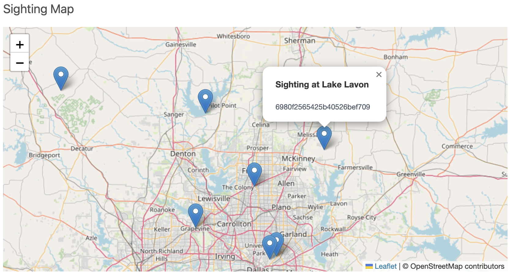
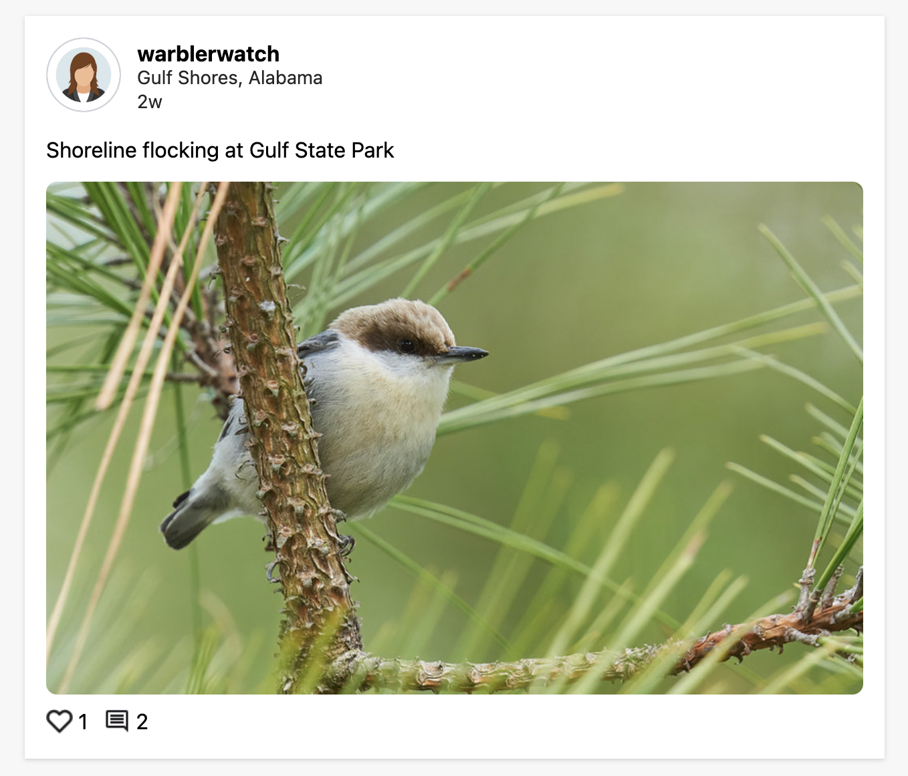
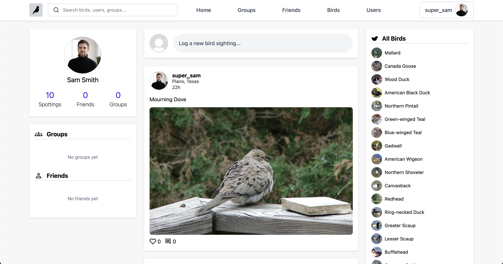
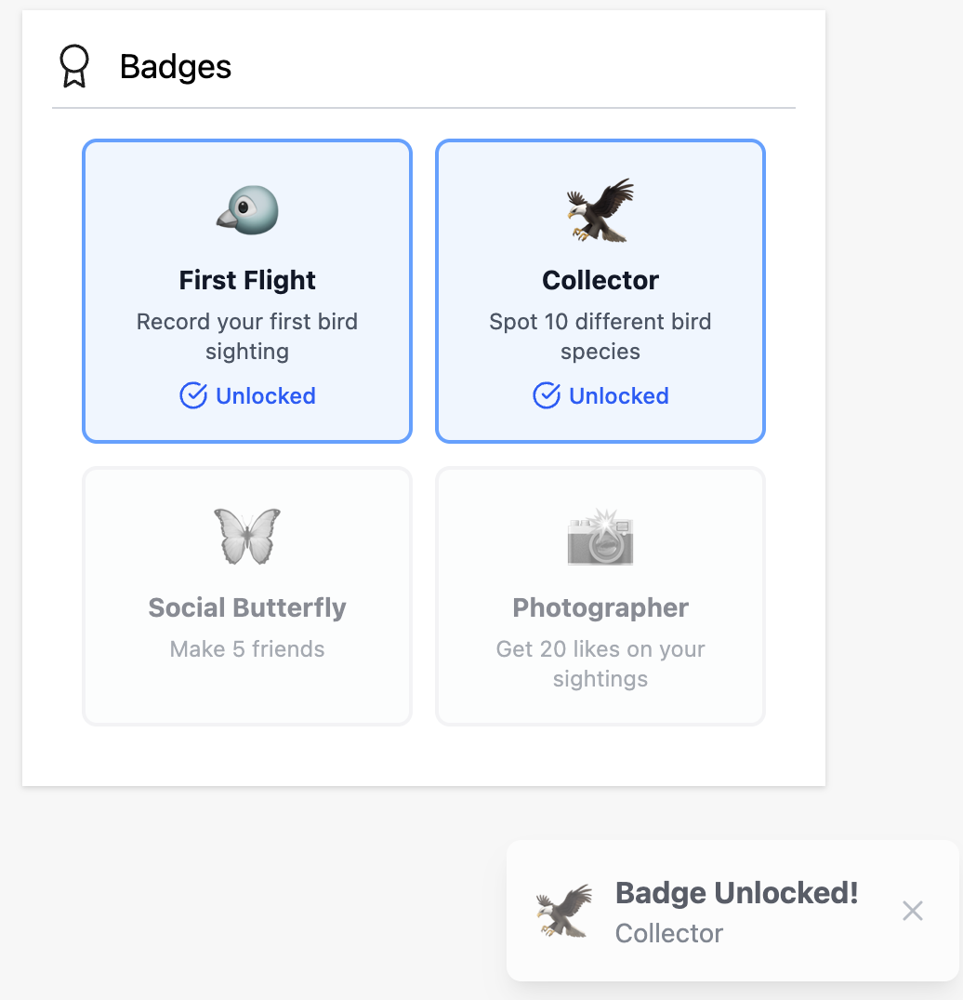
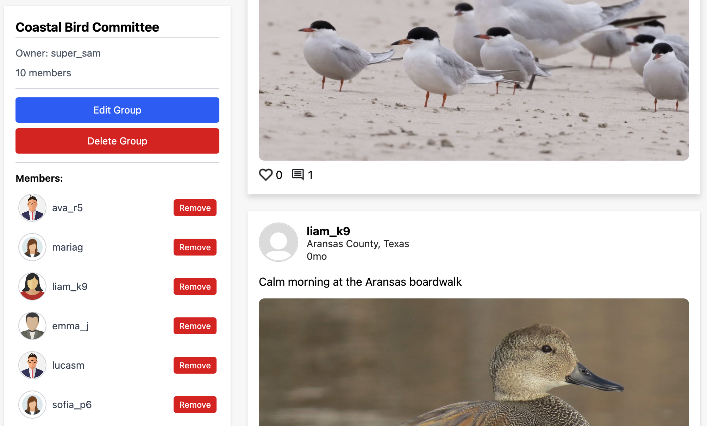
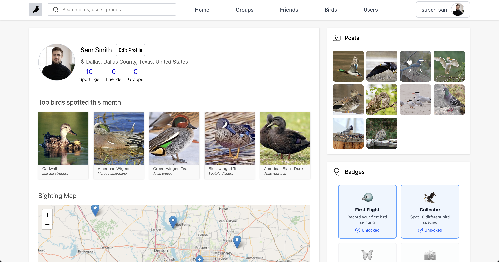

#  BirdBook

<div align="center">

### A Social Platform for Birding Enthusiasts

**Track sightings • Connect with birders • Earn achievements • Explore your local avian community**

[Live Demo](#) • [Documentation](#) • [Report Bug](#)

</div>

---

## 📖 About The Project

BirdBook is a full-stack social media application designed for bird watchers to discover, track, and share bird sightings with a vibrant community. Built with modern web technologies, the platform combines real-time geolocation mapping, user authentication, social interactions, and gamification to create an engaging birding experience.

### ✨ Key Features

- **🗺️ Interactive Sighting Map** - Visualize your bird sightings on an interactive map with location coordinates

- **📸 Photo Sharing** - Upload and share photos of your bird discoveries with detailed sighting information

- **👥 Social Feed** - Engage with the community through posts, likes, and comments

- **🏆 Achievement System** - Earn badges and track statistics as you spot more birds and interact with the platform

- **👫 Community Building** - Join birding groups, connect with friends, and share your passion

- **🔐 Secure Authentication** - Role-based access control with JWT authentication
- **📊 Personal Statistics** - Track your birding progress with comprehensive analytics


---

## 🛠️ Tech Stack

### Frontend
- **React** - Component-based UI framework
- **TypeScript** - Type-safe JavaScript
- **Tailwind CSS** - Utility-first styling
- **Vite** - Next-generation build tool
- **React Router** - Client-side routing
- **Context API** - State management

### Backend
- **Spring Boot** - Java framework for RESTful APIs
- **Spring Security** - Authentication and authorization
- **JWT** - Token-based authentication
- **Maven** - Dependency management

### Database
- **MongoDB** - NoSQL database for flexible schema design
- **Aggregation Pipelines** - Complex data queries and statistics

### Testing
- **Jest** - JavaScript testing framework
- **React Testing Library** - Component testing
- **JUnit** - Java unit testing
- **Mockito** - Mocking framework

### DevOps
- **Docker** - Containerization
- **Git** - Version control
- **CI/CD** - Automated deployments
- **Postman** - API testing

---

## 🏗️ Architecture

BirdBook follows a **layered architecture** pattern:

```
┌─────────────────────────────────────────┐
│         React/TypeScript Frontend       │
│    (Components, Hooks, Context API)     │
└─────────────────┬───────────────────────┘
                  │ REST API
┌─────────────────▼────────────────────────┐
│          Spring Boot Backend             │
├──────────────────────────────────────────┤
│  Controller Layer - HTTP Request Handling│
│  Service Layer    - Business Logic       │
│  Repository Layer - Data Access          │
└─────────────────┬────────────────────────┘
                  │
┌─────────────────▼───────────────────────┐
│            MongoDB Database             │
│   (User Profiles, Sightings, Groups)    │
└─────────────────────────────────────────┘
```

### Key Design Decisions

- **MongoDB Schema Design**: Utilized flexible document structure with proper indexing for user profiles, bird sightings, social connections, and achievement badges
- **JWT Authentication**: Stateless authentication with secure token-based authorization
- **Context API**: Lightweight state management for user sessions and application state
- **Custom Hooks**: Reusable logic for data fetching, form handling, and authentication
- **Aggregation Pipelines**: Complex queries for statistics calculation and badge awarding

---

## 🚀 Getting Started

### Prerequisites

- Node.js 16+ and npm
- Java 17+
- Maven 3.8+
- MongoDB 4.4+
- Docker (optional)

### Installation

1. **Clone the repository**
   ```bash
   git clone https://github.com/yourusername/birdbook.git
   cd birdbook
   ```

2. **Backend Setup**
   ```bash
   cd backend
   mvn clean install
   mvn spring-boot:run
   ```

3. **Frontend Setup**
   ```bash
   cd frontend
   npm install
   npm run dev
   ```

4. **Environment Variables**
   
   Create `.env` files in both frontend and backend directories:
   
   **Backend `.env`:**
   ```
   MONGODB_URI=mongodb://localhost:27017/birdbook
   JWT_SECRET=your_jwt_secret_key
   JWT_EXPIRATION=86400000
   ```
   
   **Frontend `.env`:**
   ```
   VITE_API_URL=http://localhost:8080/api
   ```

5. **Access the Application**
   - Frontend: `http://localhost:5173`
   - Backend API: `http://localhost:8080`

---

## 🧪 Testing

### Run Frontend Tests
```bash
cd frontend
npm test                 # Run all tests
npm test -- --coverage   # Generate coverage report
```

### Run Backend Tests
```bash
cd backend
mvn test                 # Run all tests
mvn test -Dtest=TestClassName  # Run specific test
```

**Test Coverage**: 85%+ across both frontend and backend

---

## 📱 User Interactions

### Posting System
- Create bird sighting posts with photos, species details, and location data
- Add descriptions and sighting notes
- Real-time feed updates

### Social Features
- **Likes & Comments**: Engage with community posts
- **Friends**: Connect with fellow birders
- **Groups**: Join or create birding communities based on location or interests

### Gamification
- **Statistics Dashboard**: Total sightings, species count, activity metrics
- **Interactive Map**: View all your sightings plotted on a map
- **Badge System**: Earn achievements for milestones (first sighting, 10 species, active poster, etc.)

---

## 👥 Team


- **Peyton Barre** - Full-Stack Developer
- **Taylor Bell** - Full-Stack Developer
- **Eshan Patel** - Full-Stack Developer
- **Matthew Weldehiwot** - Full-Stack Developer

---

## 🎯 Project Management

### Development Approach
- **Waterfall Planning + Agile Execution**
- **Epics**: Organized into Profiles, Feed, Sighting, and Groups
- **Sprint Management**: Trello/Jira for task tracking with story points
- **Version Control**: Git branching strategy with feature branches and pull requests

### Challenges & Solutions

**Challenge**: Authentication implementation  
**Solution**: Implemented JWT-based authentication with Spring Security and role-based access control

**Challenge**: Schema changes during development  
**Solution**: Leveraged MongoDB's flexible schema and implemented proper migration strategies

**Challenge**: Testing strategy  
**Solution**: Comprehensive testing approach with unit, integration, and E2E tests achieving 85%+ coverage

**Challenge**: Scope management  
**Solution**: Clear prioritization with story points and weekly task allocation

---

## 🚧 Future Enhancements

- [ ] Cloud deployment with AWS/Azure
- [ ] Advanced CI/CD pipeline integration
- [ ] Additional group features (events, challenges)
- [ ] Enhanced friend features (messaging, activity feed)
- [ ] Post moderation and content flagging
- [ ] Comment editing and deletion
- [ ] Advanced search and filtering by tags/species
- [ ] Mobile application (React Native)
- [ ] Bird identification AI integration

---

## 📄 API Documentation

### Authentication Endpoints
```
POST   /api/auth/register    - Register new user
POST   /api/auth/login       - Login user
POST   /api/auth/refresh     - Refresh JWT token
```

### User Endpoints
```
GET    /api/users/{id}       - Get user profile
PUT    /api/users/{id}       - Update user profile
GET    /api/users/{id}/stats - Get user statistics
```

### Sighting Endpoints
```
GET    /api/sightings        - Get all sightings (paginated)
POST   /api/sightings        - Create new sighting
GET    /api/sightings/{id}   - Get specific sighting
PUT    /api/sightings/{id}   - Update sighting
DELETE /api/sightings/{id}   - Delete sighting
```

### Social Endpoints
```
POST   /api/sightings/{id}/like      - Like a sighting
POST   /api/sightings/{id}/comment   - Comment on sighting
GET    /api/users/{id}/friends       - Get user's friends
POST   /api/groups                   - Create group
GET    /api/groups/{id}              - Get group details
```

*Full API documentation available at `/api/docs` when running the backend*

---

## 📜 License

This project was created as part of a training program. All rights reserved.

---

## 🙏 Acknowledgments

- **Revature** - Training and project guidance
- **Bird Photography Contributors** - Stock images used in the application
- **Open Source Community** - Libraries and frameworks that made this possible
